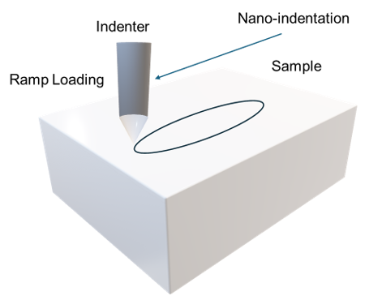

To understand the effects of various parameters present in the scratch toughness evaluation, each parameter needs to be evaluated. The critical load (the value of load necessary to observe material failure during the test) is affected by substrate and coating hardness (if the sample has both coating and substrate), the thickness of coating, coefficient of friction between the participating surfaces and internal stresses in the samples.  Other parameters affecting the critical load for the scratch test include the sample preparation (flatness and planarity), loading rate, traverse speed and the shape and design of the stylus. 
 

A wide range of material failure methods have been described in the scratch test. For instance, the coating can be detached from the substrate during the scratch test, whereas in other cases, the cracking can be present in the substrate or the coating. The scratch tests are usually complimented with optical microscopy. In the scratch tests involving the ramp loading, the distance of the scratch is very crucial for the evaluation. The distance can generally be measured using appropriate microscopy techniques. 
 

The critical load on the stylus is ascertained by piezoelectric detectors that are attached to the stylus. Based on the response of the detector, the load on the stylus can be controlled. Friction between the materials involved (sample and stylus tip) is an important factor in determining the wear characteristics of the material. The variations in the friction forces can be used as measures for the onset of the cracking and the material penetration and/or detachment. 
 

<b>Micro-scratching and wear of materials : </b> 

The conventional scratching experiment is modified to accommodate for the changes in loading. One of the methods can be to linearly increase the applied normal load. One of the key operations while performing the scratch test is the calibration of the device. The selection of stylus for the test is also very crucial, as worn stylus can affect the wear results. Use of reference material for calibration is generally encouraged prior to the actual scratch test. Figure 1 describes a simplified schematic diagram of micro-scratching experiment. The effects of the ramp loading are also observed.   

  
Figure 1: A schematic diagram of Scratch testing with ramp loading   

The effects of the ramp loading are observed in the microstructure of the sample. The trail of the wear is usually evident from the onset of the wear till the edge of the scratch. A variety of results can be obtained after the ramp loading in scratch tests, like chevron tracks, local and/or gross interfacial spallation of the coating materials.  Based on the materials being tested, the wear characteristics (like critical load) can be measured. 

